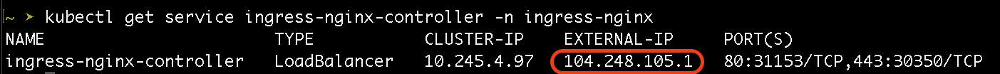

# DigitalOcean

## Overview

This guide helps configure access to Kaytu deployed on DigitalOcean Kubernetes, using NGINX Ingress Controller.

## Contents 

- [Prerequisites](#prerequisites)
- [Step 1: Installing NGINX Ingress Controller](#step-1-installing-nginx-ingress-controller)
- [Step 2: Configuring TLS Certificate using `cert-manager`](#step-2-configuring-tls-certificate-using-cert-manager)
- [Step 3: Deploying the Ingress](#step-3-deploying-the-ingress)


## Prerequisites

- Helm - [Installation guide](https://helm.sh/docs/intro/install/).
- Kubectl - [Installation guide](https://kubernetes.io/docs/tasks/tools/)
- Kaytu installed on a DigitalOcean Kubernetes Cluster.
- Access to modify DNS records of a domain.


## Step 1: Installing NGINX Ingress Controller

Add the official nginx helm repository and update helm.

```
helm repo add ingress-nginx https://kubernetes.github.io/ingress-nginx
helm repo update ingress-nginx
```

Create `nginx-ingress-values.yaml` to use when installing NGINX Ingress Controller

```
# nginx-ingress-values.yaml
controller:
  replicaCount: 2
  resources:
    requests:
      cpu: 100m
      memory: 90Mi
```

Install the NGINX Ingress Controller using helm 

```
helm install ingress-nginx ingress-nginx/ingress-nginx \
  --namespace ingress-nginx \
  --create-namespace \
  -f do/nginx-ingress-values.yaml
```

Run the following command to get the external IP address of the Ingress Controller. Look for the IP address provided in the `EXTERNAL-IP` field. 

```
kubectl get service ingress-nginx-controller -n ingress-nginx
```



**Note:** Make sure to use the above `EXTERNAL-IP` to create an `A` record with your hosting provider, to point your desired domain at this load balancer.


## Step 2: Configuring TLS Certificate using `cert-manager`

Add the official jetstack helm repository and update helm.

```
helm repo add jetstack https://charts.jetstack.io
helm repo udpate jetstack
```

Create `cert-manager-values.yaml` to use when installing cert-manager

```
# cert-manager-values.yaml
crds:
  enabled: true
prometheus:
  enabled: false
```

Install the cert-manager chart using helm

```
helm install cert-manager jetstack/cert-manager \
  --namespace cert-manager \
  --create-namespace \
  -f do/cert-manager-values.yaml
```

Create a kubernetes manifest `cert-manager-issuer.yaml` to define a certificate issuer resource. Make sure to replace the `email` field with a valid email address.

```
# cert-manager-issuer.yaml
apiVersion: cert-manager.io/v1
kind: Issuer
metadata:
  name: letsencrypt-nginx
  namespace: opengovernance
spec:
  acme:
    email: <a-valid-email-address>
    server: https://acme-v02.api.letsencrypt.org/directory
    privateKeySecretRef:
      name: letsencrypt-nginx-private-key
    solvers:
      - http01:
          ingress:
            class: nginx
```

Deploy the above manifest
```
kubectl apply -f cert-manager-issuer.yaml
```

Verify the issuer is ready
```
kubectl get issuer -n opengovernance
```
The output should be similar to below. The field `READY` should be `True`


## Step 3: Deploying the Ingress

Create a kubernetes manifest `cert-manager-issuer.yaml` to define a certificate issuer resource. Make sure to replace `<your-custom-domain>` with your domain.

```
# cert-manager-issuer.yaml
apiVersion: networking.k8s.io/v1
kind: Ingress
metadata:
  name: kaytu-ingress
  namespace: opengovernance
  annotations:
    cert-manager.io/issuer: letsencrypt-nginx
spec:
  tls:
    - hosts:
        - <your-custom-domain>
      secretName: letsencrypt-nginx
  ingressClassName: nginx
  rules:
  - host: <your-custom-domain>
    http:
        paths:
        - path: /
          pathType: Prefix
          backend:
            service:
              name: nginx-proxy
              port:
                number: 80
```

Deploy the above manifest

```
kubectl apply -f cert-manager-issuer.yaml
```

Confirm that the certificate tis issued and `Ready`

```
kubectl get certificates -n opengovernance
```
