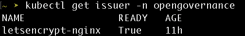

# DigitalOcean

## Overview

This guide helps configure access to Opengovernance deployed on DigitalOcean Kubernetes, using NGINX Ingress Controller.

## Contents 

- [Prerequisites](#prerequisites)
- [Step 1: Installing NGINX Ingress Controller](#step-1-installing-nginx-ingress-controller)
- [Step 2: Update DNS record](#step-2-update-dns-record)
- [Step 3: Configuring TLS Certificate using `cert-manager`](#step-3-configuring-tls-certificate-using-cert-manager)
- [Step 4: Update the Application configuration](#step-4-update-the-application-configuration)
- [Step 5: Deploying the Ingress](#step-5-deploying-the-ingress)


## Prerequisites

- Helm - [Installation guide](https://helm.sh/docs/intro/install/).
- Kubectl - [Installation guide](https://kubernetes.io/docs/tasks/tools/)
- Opengovernance installed on a DigitalOcean Kubernetes Cluster.
- Access to modify DNS records of a domain.


## Step 1: Installing NGINX Ingress Controller

Add the official nginx helm repository and update helm.

```
helm repo add ingress-nginx https://kubernetes.github.io/ingress-nginx
helm repo update ingress-nginx
```

Create `nginx-ingress-values.yaml` to use when installing NGINX Ingress Controller

```
# nginx-ingress-values.yaml
controller:
  replicaCount: 2
  resources:
    requests:
      cpu: 100m
      memory: 90Mi
```

Install the NGINX Ingress Controller using helm 

```
helm install ingress-nginx ingress-nginx/ingress-nginx \
  --namespace ingress-nginx \
  --create-namespace \
  -f nginx-ingress-values.yaml
```

It may take a few minutes for the load balancer IP to be available.
You can watch the status by running 
```
kubectl get service --namespace ingress-nginx ingress-nginx-controller --output wide --watch
```
Look for the IP address provided in the `EXTERNAL-IP` field. 

## Step 2: Update DNS record 

Create a DNS record pointing to the `A` value. In this example we wiil use `opengovernance.domain.com` to create the DNS record. 

## Step 3: Configuring TLS Certificate using `cert-manager`

> **Skip to [Step 4](#step-4--update-the-application-configuration) if you already have `cert-manager` installed.**

Add the official jetstack helm repository.

```
helm repo add jetstack https://charts.jetstack.io
```
Update the helm repository.
```
helm repo update jetstack
```

Create `cert-manager-values.yaml` to use when installing cert-manager

```
# cert-manager-values.yaml
crds:
  enabled: true
prometheus:
  enabled: false
```

Install the cert-manager chart using helm

```
helm install cert-manager jetstack/cert-manager \
  --namespace cert-manager \
  --create-namespace \
  -f cert-manager-values.yaml
```

Create a kubernetes manifest `cert-manager-issuer.yaml` to define a certificate issuer resource. Make sure to replace the `email` field with a valid email address.

```
# cert-manager-issuer.yaml
apiVersion: cert-manager.io/v1
kind: Issuer
metadata:
  name: letsencrypt-nginx
  namespace: opengovernance
spec:
  acme:
    email: <a-valid-email-address>
    server: https://acme-v02.api.letsencrypt.org/directory
    privateKeySecretRef:
      name: letsencrypt-nginx-private-key
    solvers:
      - http01:
          ingress:
            class: nginx
```

Deploy the above manifest
```
kubectl apply -f cert-manager-issuer.yaml
```

Verify the issuer is ready
```
kubectl get issuer -n opengovernance
```
The output should be similar to below. The field `READY` should be `True`




## Step 4: Update the Application configuration

Download and open the [values.yaml](https://github.com/kaytu-io/kaytu-charts/blob/main/charts/open-governance/values.yaml) file in an editor.

```
curl -O https://raw.githubusercontent.com/kaytu-io/kaytu-charts/main/charts/open-governance/values.yaml
```

The `values.yaml` must now look like the following

```
opengovernance:
  replicaCount: 1
  envType: dev
  domain:
    main: opengovernance.domain.com
...
dex:
  configSecret:
    create: false
  config:
    staticClients:
      - id: public-client
        name: 'Public Client'
        redirectURIs:
          - 'https://kaytu.app.domain/callback'
          - 'http://kaytu.app.domain/callback'
          - 'http://localhost:3000/callback'
          - 'http://localhost:8080/callback'
          - 'https://opengovernance.domain.com/callback'
          - 'http://opengovernance.domain.com/callback'
        public: true
      - id: private-client
        name: 'Private Client'
        redirectURIs:
          - 'https://kaytu.app.domain/callback'
          - 'https://opengovernance.domain.com/callback'
          - 'http://opengovernance.domain.com/callback'
...
```

For an example refer to this [values.yaml](https://github.com/ADorigi/scratch/blob/main/example/values.yaml)

Apply these changes to the cluster using the following command 

```
helm upgrade -f values.yaml opengovernance opengovernance/open-governance -n opengovernance 
```

Once the changes have been applied, we need to restart the pod corresponding to dex.

Retrieve the pod name:

```
POD_NAME=$(kubectl get pods -n opengovernance -l app.kubernetes.io/instance=opengovernance,app.kubernetes.io/name=dex -o jsonpath='{.items[*].metadata.name}')

```
Delete the pod:
```

kubectl delete pod $POD_NAME -n opengovernance
```

## Step 5: Deploying the Ingress

Create a kubernetes manifest `ingress.yaml` to define an ingress. Make sure to replace `<your-custom-domain>` with your domain.

```
# ssuer.yaml
apiVersion: networking.k8s.io/v1
kind: Ingress
metadata:
  name: kaytu-ingress
  namespace: opengovernance
  annotations:
    cert-manager.io/issuer: letsencrypt-nginx
spec:
  tls:
    - hosts:
        - <your-custom-domain>
      secretName: letsencrypt-nginx
  ingressClassName: nginx
  rules:
  - host: <your-custom-domain>
    http:
        paths:
        - path: /
          pathType: Prefix
          backend:
            service:
              name: nginx-proxy
              port:
                number: 80
```

Deploy the above manifest

```
kubectl apply -f issuer.yaml
```

Confirm that the certificate is issued and `Ready`. The certificate might take a few minutes to get to `Ready` state.

```
kubectl get certificates -n opengovernance
```
